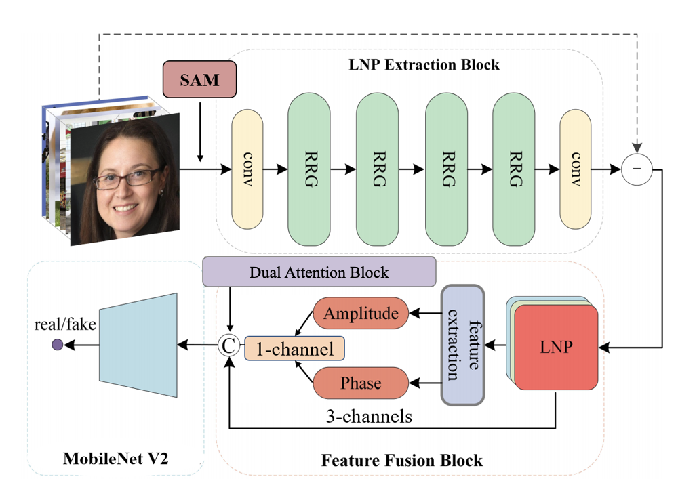

# Detecting Face Images Generated by AI


> **Project Description:** Recent advances in deep image synthesis techniques, particularly Generative Adversarial Networks (GANs), have enabled the creation of highly realistic face images, making it increasingly difficult to distinguish synthetic faces from real ones. While these models have many positive applications, they also raise serious concerns related to identity fraud and misinformation. This project focuses on detecting AI-generated face images in a robust and generalizable manner. By integrating spatial, noise-based, and frequency-domain features, the proposed approach aims to distinguish real faces from synthetic ones across different generation methods.
> 
> **Project paper:** `DFIG_v2.pdf`
> 
> **Implementation tutorial:** `README_Main_Project.ipynb`
> 
> **Pipeline:** **SAM** segments face regions → **CycleISP** extracts **LNP (Learned Noise Patterns)** → compute **FFT amplitude/phase** inside the classifier backbone → fuse features via three **fusion modes** → classify with **ResNet50** or **MobileNetV2**.

- Python ≥ 3.8 · PyTorch ≥ 1.13.1 (CUDA 11.7)
- Recommended GPU: single **NVIDIA RTX 2080**

---

## Environment Setup

```bash
pip install -r requirements.txt
```

---

## Datasets

Typical sources (examples):

- **FFHQ** (real faces, NVIDIA): <https://github.com/NVlabs/ffhq-dataset>
- **1-Million-Fake-Faces** (synthetic, Kaggle): <https://kaggle.com/datasets/tunguz/1-million-fake-faces>

This repo assumes a **two‑class directory layout** (`real/`, `fake/`) with `train/`, `val/`, and `test/` splits.

---

## Feature Extraction & Visualization

### A. Segmentation (Segment Anything, **SAM**)

- Script: `SAM.py` (contains additional setup notes)
  
- Purpose: produce **face region masks** and masked images
  
- Pretrained weights (large, ~2GB):
  
  - **ViT-H**: `sam_vit_h_4b8939.pth` (see `SAM.py` / the notebook for official links)
- Example outputs:
  
  ```text
  ./results_mask/masks/...
  ```
  

### B. LNP (Learned Noise Patterns via **CycleISP**)

- Implemented in `Project_LNP.py` using a CycleISP denoising backbone
  
- Pretrained weights: `./pretrained/sidd_rgb.pth`
  
- Run:
  
  ```bash
  python Project_LNP.py
  ```
  
- Example outputs (mirrors dataset splits and classes):
  
  ```text
  ./results_mask/LNP/train/{real,fake}/...
  ./results_mask/LNP/val/{real,fake}/...
  ./results_mask/LNP/test/{real,fake}/...
  ```
  

> The accompanying notebook includes visualizations for **Original / Face Crop / LNP Amplitude Spectrum (A.S.) / LNP Phase Spectrum (P.S.)** to help you inspect feature-space differences.

---

## Feature Fusion & Classifiers

Three **feature fusion modes** (FFT amplitude/phase computed inside the backbone):

- **Mode 0**: `Concat[ ChannelAttention(A.S. + P.S.), LNP ]`
- **Mode 1**: `ChannelAttention[ Concat(A.S. + P.S. + LNP) ]`
- **Mode 2**: `Concat( A.S. + P.S. + LNP )`

Two **CNN backbones**:

- `arch=res50` → **ResNet50**
- `arch=mobilev2` → **MobileNetV2**

Pretrained classifiers:

- **ResNet50**: download the official `resnet50-19c8e357.pth` and place/rename to `./pretrained/resnet50.pth`
- **MobileNetV2**: ensure a compatible MobileNetV2 weight exists at `./pretrained/mobilenetv2.pth` (if not, obtain one as needed)

---

## Training

Below is an example using **Mode 0 + MobileNetV2** and the **LNP** feature directory as the dataset root:

```bash
python train.py   --name mob_mode0_cha   --dataroot ./results_mask/LNP   --classes face   --arch mobilev2   --train_mode 0
```

**Key arguments**

- `--dataroot`: dataset root containing `train/`, `val/`, `test/` with `real/` and `fake/` subfolders (e.g., `./results_mask/LNP`)
- `--arch`: `mobilev2` or `res50`
- `--train_mode`: `0 | 1 | 2` (the three fusion mechanisms above)
- Checkpoints and logs are saved to `./checkpoints/<--name>/*`

> Tip: run `python train.py --help` to see full options (batch size, epochs, input size, etc.).

---

## Testing / Inference

Use `demo_dir.py` to predict for all images under a directory (example: **Mode 0 + MobileNetV2**):

```bash
python demo_dir.py   --backbone mobilev2   --mode 0   --model_path ./checkpoints/mob_mode0_cha/model_epoch_best.pth   --input_dir ./results_mask/LNP/test
```

- Set `--model_path` to the path of your best trained weights.
- Alternatively, evaluate on a full test split by loading trained weights and running batch prediction and metrics as shown in the notebook.

---

## Acknowledgments

- **FFHQ**: <https://github.com/NVlabs/ffhq-dataset>
- **1-Million-Fake-Faces**: <https://kaggle.com/datasets/tunguz/1-million-fake-faces>
- **Segment Anything (SAM)**: thanks to Meta AI for releasing the models
- **CycleISP**: thanks to the original authors for open-sourcing

---

## Citation

- If this project is useful in your research or product, please cite the repository.
